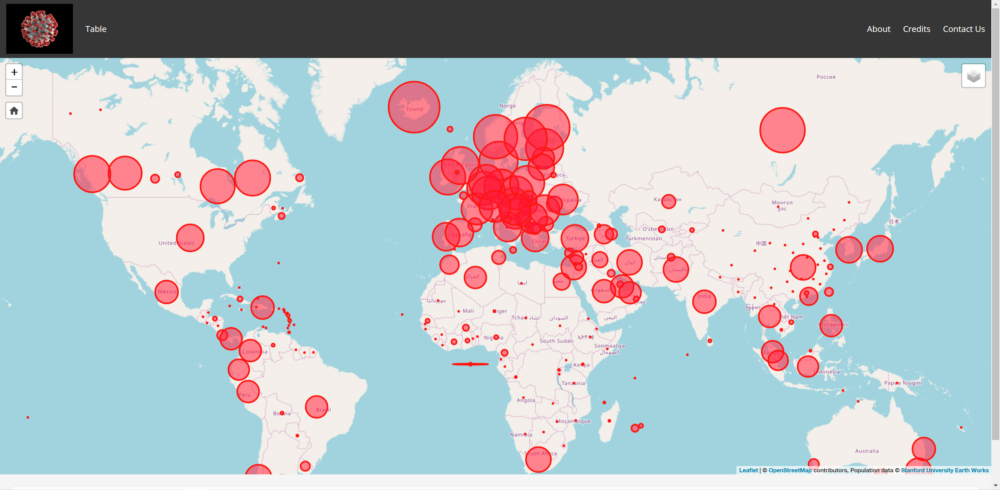
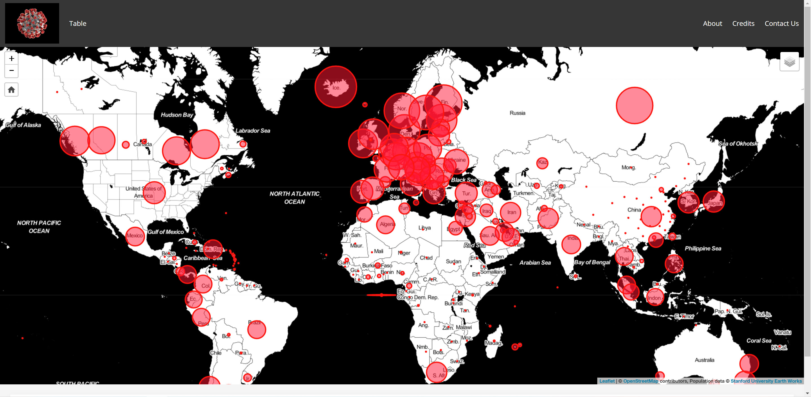

# covid19-viz
<!-- ALL-CONTRIBUTORS-BADGE:START - Do not remove or modify this section -->
[](#contributors-)
<!-- ALL-CONTRIBUTORS-BADGE:END -->
Latest COVID-19 Stats Visualisations

Street Map View



Black and White Map View



# Contribution Guidelines
Contributions can be made through pull requests.
* You can start by forking this repo
* Contribute to a branch relevant to you, if it exists
* Otherwise, create a new branch, for a new implementation, for example; REST, Java, React, Vue, Laravel, etc
* Once you are ready and everything checks out, you can push to your forked repo and create a pull request against this repo
* We will then review and approve

### Step 1: Fork the repository

To fork an repository, click on the Button **Fork** on every Github repository page.


### Step 2: Clone the repository

```shell
git clone git@github.com:YOUR_USERNAME/REPOSITORY_NAME.git
# Clones your fork of the repository into the current directory in terminal on your computer
```

### Step 3: Make changes and push code
If you would like to fix issues, please use issue number as feature branch name.

### Step 4: Create a pull request on Github

This [article](https://help.github.com/articles/using-pull-requests) describes in a very good way how to create a pull request on the Github platform.

# Contributors

@all-contributors bot

## Contributors ✨

Thanks goes to these wonderful people ([emoji key](https://allcontributors.org/docs/en/emoji-key)):

<!-- ALL-CONTRIBUTORS-LIST:START - Do not remove or modify this section -->
<!-- prettier-ignore-start -->
<!-- markdownlint-disable -->
<table>
  <tr>
    <td align="center"><a href="http://oneziko.com"><br /><sub><b>Chizzo Cheese</b></sub></a><br /><a href="https://github.com/Chizzoz/covid19-viz/commits?author=Chizzoz" title="Code">💻</a> <a href="#design-Chizzoz" title="Design">🎨</a></td>
  </tr>
</table>

<!-- markdownlint-enable -->
<!-- prettier-ignore-end -->
<!-- ALL-CONTRIBUTORS-LIST:END -->

This project follows the [all-contributors](https://github.com/all-contributors/all-contributors) specification. Contributions of any kind welcome!